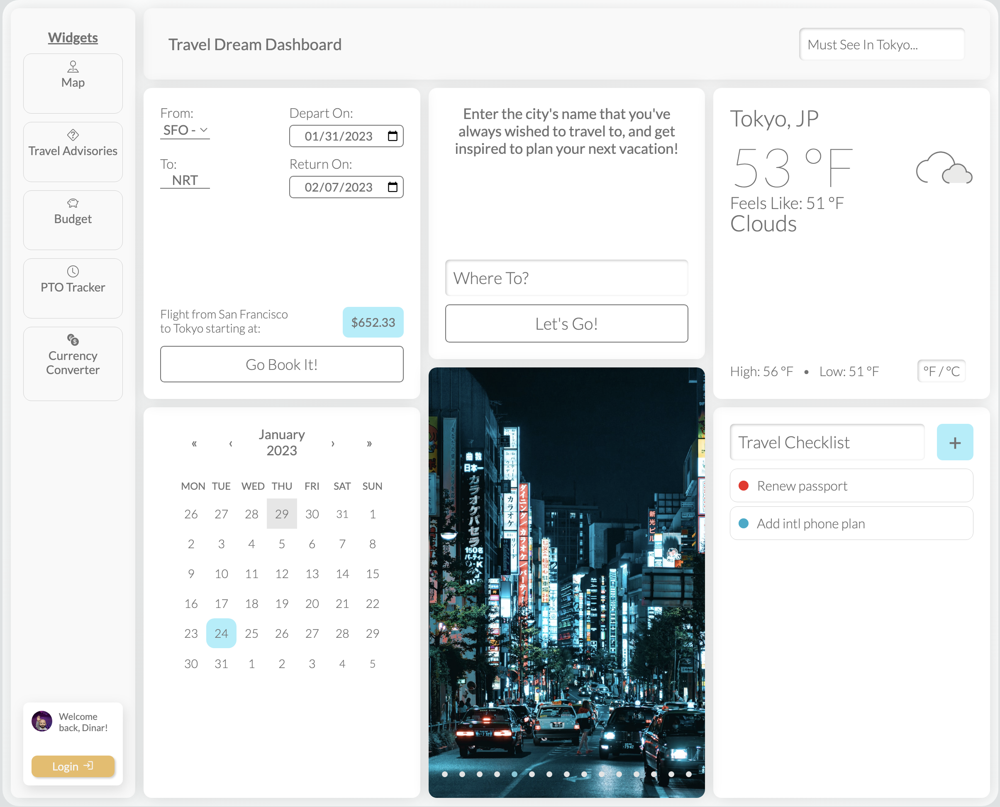
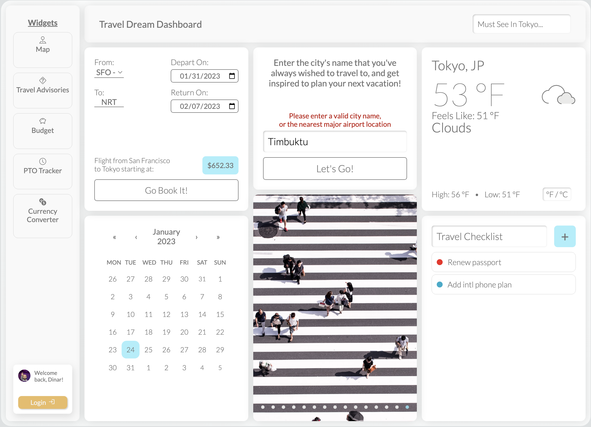
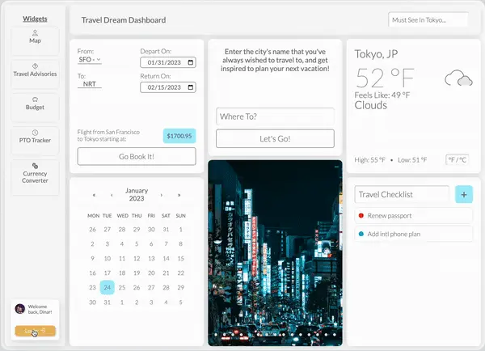

<!-- PROJECT LOGO -->

<br />
<div align="center" id="top">
  <a href="https://github.com/dinardavis/travel_app">
    
  </a>

<h3 align="center">Travel Dream Dashboard</h3>
     
   <p align="center">
    With the love of travel in mind, this project was created to serve as a one stop shop for travel junkies to get and/or stay excited for their next trip. The functionality is very straightforward; enter the name of a city that you've always dreamed of visiting, the dates that you're availabe to go there, and voila! The dashboard will return the price of a roundtrip flight to that destination, and some other useful info to get your imagination flowing about your next adventure!
    <br />
    <br />
    <a href="https://github.com/dinardavis/travel_app"><strong>Explore the docs »</strong></a>
    <br />
    <br />
    <a href="https://dinardavis.github.io/travel_app/">View Demo</a>
    ·
    <a href="https://github.com/dinardavis/travel_app/issues">Report Bug</a>
    ·
    <a href="https://github.com/dinardavis/travel_app/issues">Request Feature</a>
  </p>
</div>


<!-- TABLE OF CONTENTS -->
<details>
  <summary>Table of Contents</summary>
  <ol>
    <li>
      <a href="#about-the-project">About The Project</a>
      <ul>
        <li><a href="#built-with">Built With</a></li>
      </ul>
    </li>
    <li>
      <a href="#getting-started">Getting Started</a>
      <ul>
        <li><a href="#tools">Tools</a></li>
        <li><a href="#setup">Setup</a></li>
      </ul>
    </li>
    <li><a href="#usage">Usage</a></li>
    <li><a href="#future-iterations">Future Iterations</a></li>
    <li><a href="#contributing">Contributing</a></li>
    <li><a href="#contact">Contact</a></li>
  </ol>
</details>


<!-- ABOUT THE PROJECT -->
## About The Project

<br />

<div align="center">
  
</div>

<br />

<p align="right">(<a href="#top">back to top</a>)</p>


### Built With

* 
*  
* 
* 


<p align="right">(<a href="#top">back to top</a>)</p>


<!-- GETTING STARTED -->
## Getting Started

## Tools

* [git](https://git-scm.com/downloads): A tool for managing source code
* [Visual Studio Code](https://code.visualstudio.com/): A source code editor
* API Keys for: 
    <br />
    * Openweather API
    * Unsplash API
    * Skyscanner API

## Setup

As this application requires several different API keys, if you wish to only view its functionality, it is recommended to visit the [Live Demo](https://dinardavis.github.io/travel_app/), instead of running the application locally. 

However, if you do wish to adapt or make contributions please do the following:

* With git clone the code to your machine, or download a ZIP of all the files directly.

    [Download the ZIP from this location](https://github.com/dinardavis/spacex_clone), or run the following command to clone the files to your machine:

```bash
git clone https://github.com/dinardavis/travel_app
```
* Once the files are on your machine, open the _travel_app_ folder in [Visual Studio Code](https://code.visualstudio.com/).

* Sign up and obtain API keys for:
  <br />
    * [Openweather API](https://openweathermap.org/api)
    * [Unsplash API](https://unsplash.com/developers)
    * [Skyscanner API](https://rapidapi.com/DataCrawler/api/skyscanner50/)

* Add API keys and secret to /.env file using the format:

    REACT_APP_OPENWEATHER_API_KEY=[API KEY HERE] <br />
    REACT_APP_UNSPLASH_API_KEY=[API KEY HERE] <br />
    REACT_APP_UNSPLASH_SECRET_KEY=[API SECRET KEY HERE] <br />
    REACT_APP_FLIGHT_API_KEY=[API KEY HERE]

* In the project root directory run: 

```bash
npm install
```

then...


```bash
npm start
```


<p align="right">(<a href="#top">back to top</a>)</p>


<!-- USAGE EXAMPLES -->
## Usage

In this project I have included various error handling for instaces of failed API fetch retrievals. (Which happen frequently with the flight info. Apologies, but it's the best API that I could find for this data.) Also covered are cases where the user inputs a city that is not included in the working data set. 

<div align="center">
  
</div>


## Future Iterations

Additionally, included in the sidebar are examples of several widgets that could be added to the project in the future such as a user login component to personalize and store the search data, travel advisory alerts, and a foreign currency tracker. Currently, the user will be greeted with a "Coming Soon" notification when interacting with any of this planned enhancements. 

<div align="center">
  
</div>

<p align="right">(<a href="#top">back to top</a>)</p>


<!-- CONTRIBUTING -->
## Contributing

This project has been a great opportunity to develop further familiarity with React and working with API data. It also provides a ton of flexibility and room to add and improve on this foundation, so if you want to make any contributions please feel free!

If you like the project, a star would be much appreciated! Thanks again!

For any additions please do the following: 

1. Fork the Project
2. Create your Feature Branch (`git checkout -b feature/NewFeature`)
3. Commit your Changes (`git commit -m 'Add some NewFeature'`)
4. Push to the Branch (`git push origin feature/NewFeature`)
5. Open a Pull Request

<p align="right">(<a href="#top">back to top</a>)</p>


<!-- CONTACT -->
## Contact

 <a href="https://www.linkedin.com/in/dinardavis/">
    
  </a>
  <a href="https://twitter.com/dinardavis">
    
  </a>

Project Link: [https://github.com/dinardavis/spacex_clone](https://github.com/dinardavis/travel_app)

<p align="right">(<a href="#top">back to top</a>)</p>
